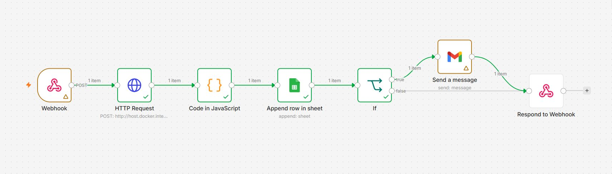
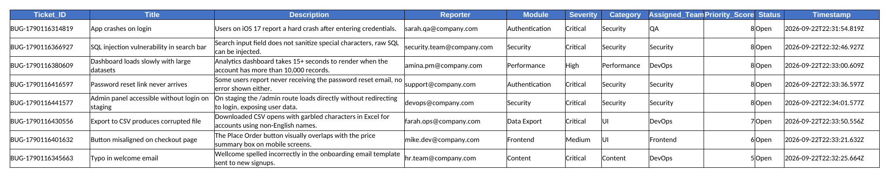

# Bug Report Triage for Dev Teams

    

Someone files a bug. Moments later it has a ticket ID, a severity, a category, an owning team and a priority score, it is sitting in a shared sheet, and if it looks serious an email has already gone out. Nobody read it by hand.

This is an n8n workflow that does that with a **local** language model. The classifier is `llama3.2:3b` running in Ollama on the same machine as n8n, so there are no AI API keys, no per-call cost, and the classification step never sends bug text to a third-party model. Google Sheets is the ticket database and Gmail is the alarm bell.



## What it does

| Step | What happens |
|---|---|
| Intake | A bug report arrives as a JSON POST: title, description, reporter, module |
| Classification | A local LLM returns severity, category, assigned team and a 1 to 10 priority score |
| Ticketing | The result is merged with the original report and given a `BUG-` ticket ID |
| Logging | The ticket is appended as a new row in a Google Sheet |
| Escalation | Critical and High tickets trigger a Gmail alert |
| Reply | The caller gets back `{status, ticket_id, severity}` |

Eight test reports went through end to end. Every one got a unique ticket ID and a row in the sheet, and the email branch fired exactly when it was supposed to.

## How a report moves through the workflow

Seven nodes, one straight line with a single fork near the end.

**1. Webhook.** Listens for `POST /bug-report`. It is set to respond through a dedicated node at the end, so the caller waits and receives the ticket details instead of an instant "OK".

**2. HTTP Request.** Calls Ollama's `/api/generate` endpoint at `http://host.docker.internal:11434`, with `stream: false` and `format: "json"` so the answer comes back as one complete JSON string. The prompt gives the model its role, lists the allowed values for every field, and only passes in the title, description and module. The reporter's email is not sent to the model.

The contract the model has to follow:

```json
{
  "severity": "Critical | High | Medium | Low",
  "category": "UI | Backend | Security | Performance | Content | Data",
  "assigned_team": "Frontend | Backend | QA | Security | DevOps",
  "priority_score": 1-10
}
```

**3. Code in JavaScript.** Parses the model's JSON and merges it with the original webhook body. It builds the ticket ID as `BUG-` plus the current timestamp in milliseconds, sets the status to `Open`, and stamps an ISO timestamp. The node runs once per item.

**4. Append row in sheet.** Writes the ticket into Google Sheets, one column per field: Ticket_ID, Title, Description, Reporter, Module, Severity, Category, Assigned_Team, Priority_Score, Status, Timestamp.

**5. If.** Checks whether Severity equals `Critical` or `High`. True goes to Gmail, false skips straight to the response.

**6. Send a message (Gmail).** Sends a plain-text alert with the subject `<Severity> Bug — <Title> (Ticket #<ID>)` and a body listing the ticket ID, title, description, module, assigned team and priority score.

**7. Respond to Webhook.** Returns `{ "status": "received", "ticket_id": ..., "severity": ... }` to whoever posted the report.

## The test run

The eight payloads are in [`data/sample_bug_reports.json`](data/sample_bug_reports.json). They cover a login crash, a typo, a SQL injection, a slow dashboard, a layout bug, a missing password reset email, a corrupted CSV export and an unprotected admin route. They were posted to the webhook one by one with curl, and the resulting sheet looks like this:



*Rendered from the exported sheet in [`data/Bug_Tracker_Sheet_Organized.xlsx`](data/Bug_Tracker_Sheet_Organized.xlsx), sorted by priority score.*

Here is what the model decided, next to how I would have called each one:

| Report | Model's call | My read |
|---|---|---|
| SQL injection in search bar | Critical, Security, Security team, 8 | Agree |
| Admin panel open on staging | Critical, Security, Security team, 8 | Agree |
| Button misaligned on checkout | Medium, UI, Frontend, 6 | Agree |
| Dashboard slow with 10k+ records | High, Performance, DevOps, 8 | Reasonable |
| App crashes on login (iOS 17) | Critical, Security, QA, 8 | Severity fine, category is a stretch |
| Password reset email never arrives | Critical, Security, Security team, 8 | High would do, and it reads more like a Backend problem |
| CSV export garbles non-English names | Critical, UI, DevOps, 7 | Medium, Data, Backend |
| Typo in welcome email | Critical, Content, DevOps, 5 | Low, and not a DevOps ticket |

The "my read" column is my own judgment, not a labeled dataset, so treat it as one opinion.

Two patterns stand out. The model used Critical six times out of eight and Low never, so seven of the eight reports triggered an email, and an alert channel where nearly everything is urgent stops being read. And five tickets got a priority score of exactly 8, so the score barely separates them. Both look like what a 3B model does when the prompt lists the labels but never says what they mean.

That is a fixable problem, and I wrote down the fixes below. It is also the reason this repo shows the raw results instead of only the cases that worked.

## Stack

| Component | Tool | Role |
|---|---|---|
| Automation engine | n8n, self-hosted in Docker | Runs the workflow |
| Local AI | Ollama with `llama3.2:3b` | Classifies each report |
| Ticket storage | Google Sheets | One row per ticket |
| Notifications | Gmail (OAuth2) | Alerts on Critical and High |
| Tunnel | ngrok | Exposes the local webhook for outside testing |
| Glue | n8n Code node (JavaScript) | Parses and shapes the ticket |

## Problems I hit along the way

Five things cost me time, and none of them showed a red error in the UI.

- **Ollama returned a 404.** The model name has to match exactly. `llama3.2:3b` works, `llama3.2` does not.
- **The HTTP Request node sent the wrong body.** It had to be switched from "Using Fields Below" to "Using JSON" before the prompt reached Ollama intact.
- **The Code node returned a mess.** It needed "Run Once for Each Item", otherwise it tried to return one object for the whole batch.
- **Google Sheets returned capitalized keys.** The Sheets node gives back `Severity` and `Ticket_ID`, so the If and Gmail nodes had to reference exactly those, not the lowercase names from the Code node.
- **n8n could not see Ollama.** From inside the Docker container, `localhost` is the container itself. Ollama on the host is reached at `host.docker.internal`.

Most of these only showed up once I read the actual execution data of each node instead of trusting the green checkmarks, and once I ran the whole chain instead of single nodes. Expressions that depend on earlier nodes have nothing to read when a node runs alone.

## Run it yourself

You need Docker, n8n, Ollama and a Google account.

1. Start n8n in Docker and pull the model on the host: `ollama pull llama3.2:3b`.
2. Create a Google Sheet with the eleven column headers listed under "Append row in sheet" above.
3. In n8n, import [`workflow/bug-report-triage.json`](workflow/bug-report-triage.json).
4. Connect your own Google Sheets and Gmail credentials, then pick your sheet in the Google Sheets node (the export has a `YOUR_GOOGLE_SHEET_ID` placeholder).
5. Run the test reports:

```bash
WEBHOOK_URL=http://localhost:5678/webhook-test/bug-report ./scripts/send_test_reports.sh
```

Use `/webhook-test/` while the workflow is open in the editor and listening, and `/webhook/` once you activate it. The script needs `curl` and `jq`.

The exported workflow has had my credential IDs, n8n instance ID and sheet ID removed, so you will reconnect those after import. The alert emails go to whatever address is in the `reporter` field, and the sample reporters use a made-up `company.com` domain, so to see a real alert arrive, put your own address in a payload.

## What I would change next

- **Tell the model what the labels mean.** Add a short rubric to the prompt (Critical means data exposure or a full outage, Low means cosmetic) and a few worked examples. This is the cheapest fix and should deal with the typo-is-Critical problem.
- **Lower the temperature** so the same report gets the same answer twice.
- **Guard the JSON parse.** The Code node calls `JSON.parse` straight on the model output, so a malformed reply would stop the run. A try/catch that falls back to a "needs human triage" ticket would keep the pipeline alive.
- **Route alerts to the assigned team, not the reporter.** Right now the email goes to the person who filed the bug. A lookup from `assigned_team` to a team address or a Slack channel is the obvious next step.
- **Pin obvious cases with rules.** Words like "injection", "exposed" or "without login" could force Critical and Security regardless of what the model says.
- **Try a bigger model** and compare it against a small hand-labeled set of reports. A 3B model was a reasonable trade for free and local, but it is the main source of the mistakes above.

## Repository layout

```
.
├── README.md
├── workflow/
│   └── bug-report-triage.json      importable n8n workflow
├── data/
│   ├── sample_bug_reports.json     the eight test payloads
│   └── Bug_Tracker_Sheet_Organized.xlsx   the resulting ticket log
├── scripts/
│   └── send_test_reports.sh        posts the payloads to the webhook
└── screenshots/
    ├── 01-n8n-workflow-canvas.png
    └── 02-bug-tracker-sheet.png
```

## Author

Romith
GitHub: [@ismam-tasnime](https://github.com/ismam-tasnime)
